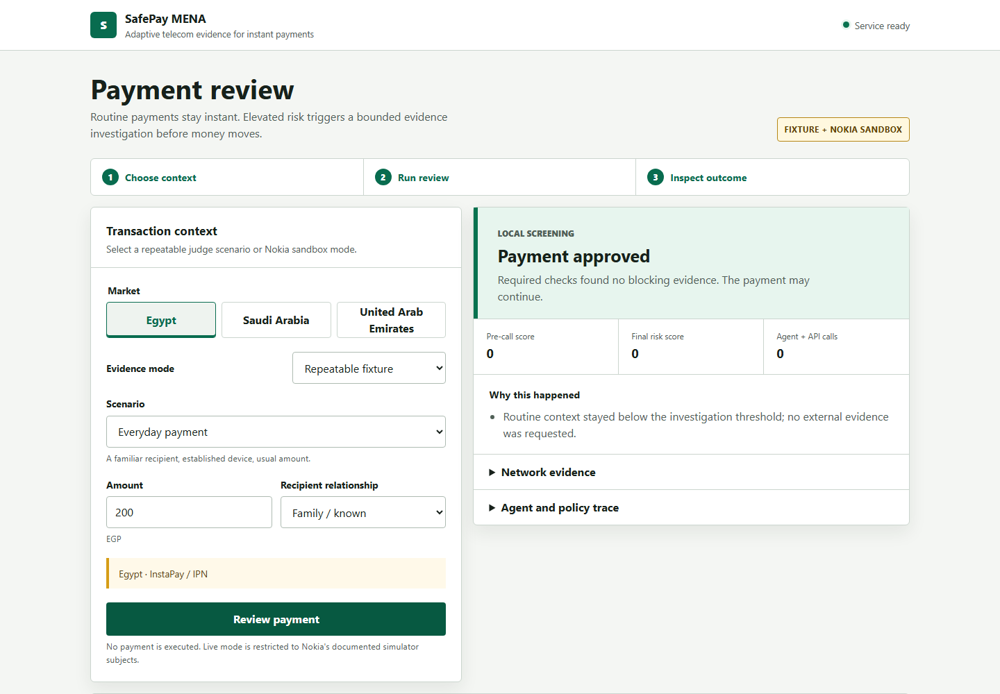

# SafePay MENA

SafePay MENA is a GSMA MENA Ignite Phase 2 working prototype for adding telecom evidence to payment-release decisions.

Routine payments stay on a local zero-call path. Elevated-risk payments trigger a bounded Gemini function-calling agent that selects relevant CAMARA APIs through Nokia Network as Code. A deterministic policy owns the final disposition.

> This is a hackathon prototype. Bank context is synthetic, Nokia calls use sandbox simulator subjects, and no production payment or mobile network is connected.

## Working Flows

- Everyday payment: immediate local approval with zero agent/API calls.
- First setup and new phone: mandatory fresh Number Verification and SIM Swap checks.
- Suspicious transfer: hold even when identity verifies, because identity does not prove safe intent.
- SIM-swap takeover: combine SIM, device, and session evidence.
- Card leakage: model checkout and registered-number mismatch separately from bank transfer.
- Planned travel: roaming is context, never fraud by itself.
- Provider outage: unknown evidence returns retry and never becomes a clean signal.
- Velocity: repeated payments remain in one session and leave the zero-call path.

Markets are represented as configurable demo contexts:

| Market | Currency | Instant-payment context |
|---|---|---|
| Egypt | EGP | InstaPay / IPN |
| Saudi Arabia | SAR | sarie |
| United Arab Emirates | AED | Aani |

This does not claim production operator coverage or regulatory certification in those markets.

## Architecture

    Payment context
          |
          v
    Local pre-screen -- routine --> APPROVE (zero external calls)
          |
          | elevated risk
          v
    Bounded Gemini agent --> Nokia/CAMARA sandbox observations
          |
          v
    Deterministic release policy --> APPROVE | HOLD | BLOCK | RETRY

The model receives amount, recipient relationship, country, channel, anomaly facts, and pre-screen reasons. It never receives the canned scenario label. Tool names, endpoints, simulator subjects, redirect hosts, repeat calls, and call budgets are enforced outside the model.

Implemented Nokia sandbox tools:

- SIM Swap
- Number Verification with bound OAuth state
- Device Swap
- Roaming
- Reachability

SafePay does not claim an active-call API. Provider errors and malformed responses are recorded as UNKNOWN.

## Run Locally

    python -m venv .venv
    .\.venv\Scripts\Activate.ps1
    pip install -r requirements.txt
    python -m uvicorn app.main:app --reload

Open http://127.0.0.1:8000.

Fixture mode works without credentials and is the default for public deployments.

## Optional Live Sandbox

Create .env from .env.example, then set:

    SAFEPAY_ENABLE_LIVE=true
    NOKIA_RAPIDAPI_KEY=your_key
    GEMINI_API_KEY=your_key

Live mode is restricted to Nokia's documented +99999991000 and +99999991001 simulator subjects. Keep this mode local or behind an authenticated, quota-controlled environment.

## Test

    python -m pytest -q

The in-product acceptance evaluation is also available from the web interface or:

    curl -X POST http://127.0.0.1:8000/api/v1/evaluations

It runs 36 synthetic cases across Egypt, Saudi Arabia, and the UAE. These results verify software behavior, not real-world fraud-detection accuracy.

Browser acceptance can be run against a local server:

    $env:SAFEPAY_BROWSER_URL="http://127.0.0.1:8000"
    python -m pytest tests/test_browser.py -q

## API

| Endpoint | Purpose |
|---|---|
| POST /api/v1/sessions | Start an isolated one-hour demo session |
| POST /api/v1/enrollments | Establish fresh device trust |
| POST /api/v1/payments | Screen and, when needed, investigate a payment |
| GET /api/v1/runs/{id} | Retrieve the stored result |
| POST /api/v1/runs/{id}/cancel | Cancel a pending or held run |
| POST /api/v1/evaluations | Run the synthetic acceptance suite |
| GET /api/v1/health | Deployment health check |

## Deploy

The included render.yaml deploys a fixture-only FastAPI web service. No provider keys are required or configured.

[Deploy to Render](https://render.com/deploy?repo=https://github.com/karimabdelnabi05/SafePay-MENA)

Render's official FastAPI instructions use pip install -r requirements.txt and Uvicorn bound to PORT: [Render FastAPI guide](https://render.com/docs/deploy-fastapi).

## Phase 2 Material

- [Pitch deck](docs_and_presentations/SafePay_MENA_Phase2_Pitch_Deck.pdf)
- [Pitch source](SafePay_MENA_Pitch_Deck_Content.md)
- [Nokia sandbox verification](docs_and_presentations/NOKIA_SANDBOX_VERIFICATION.md)
- [Claim verification](docs_and_presentations/PHASE2_CLAIM_VERIFICATION.md)
- [TDD build log](docs_and_presentations/TDD_BUILD_LOG.md)
